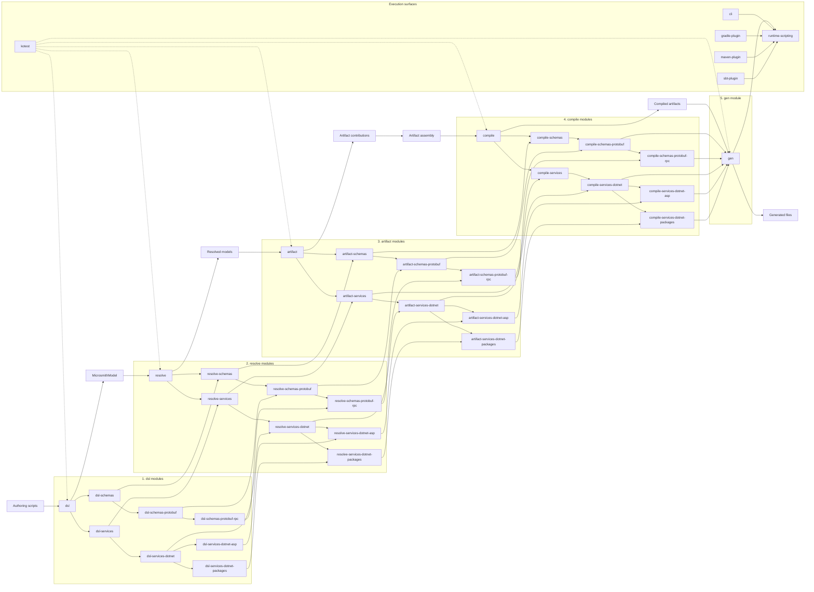

# Microsmith

Microsmith is a Kotlin DSL and standalone CLI for declaring domain-specific models and generating artifacts from `.microsmith.kts` scripts.
It is designed to work both inside this Gradle repository, inside consumer Gradle builds, and from standalone consumer repositories including Go, .NET, Node, Python, Ruby, Rust, Java, Kotlin, and Scala projects.

This README is the canonical repository documentation.

## Contents

- Overview
- Generation architecture
- Repository modules
- Repository layout
- Repository Kotlin standards
- Build, test, and quality gates
- DSL usage
- Standalone CLI for consumer repositories
- Native Gradle integration
- Native Maven integration
- Native sbt integration
- Installation and verification
- Command reference
- JetBrains IDE helper
- Plugin resolution and security model
- CI examples
- Example fixtures
- Validation matrix and release checklist
- Troubleshooting
- Migration from Gradle
- Distribution and release artifacts

## Overview

Microsmith provides:

- a core immutable model built from `microsmith { ... }`
- extension points for schema and generation dialects
- a layered generation pipeline spanning authoring DSLs, resolved domain models, logical artifacts, artifact compilation, and final output rendering
- a standalone CLI for running `.microsmith.kts` scripts without embedding Gradle in consumer repositories
- bundled built-in providers for the default schema and protobuf workflows
- a native Gradle plugin for Java, Kotlin, and Scala repositories that want imported-project build alignment
- a native Maven plugin for Java, Kotlin, and Scala repositories that want imported-project build alignment
- a native sbt plugin for Scala repositories that want build-aligned generation inside sbt
- a JetBrains IDE helper workflow for stronger type resolution in consumer repositories

## Generation architecture

Microsmith generation is organized into five explicit stages:

1. `dsl-*`: authoring-facing builders and immutable extension models
2. `resolve-*`: normalization, inheritance application, and semantic validation into finalized domain models
3. `artifact-*`: logical artifact creation and contribution assembly
4. `compile-*`: artifact-to-artifact compilation into renderable file artifacts
5. `gen`: final rendering, output routing, and file writing

Generators consume finalized models and compiled artifacts instead of raw authoring DSL state.

The graph below shows the central runtime data flow and the Gradle subprojects that participate in each stage.


```mermaid
flowchart LR
    Script[Authoring scripts]
    Model[MicrosmithModel]
    Resolved[Resolved models]
    Contributions[Artifact contributions]
    Assembly[Artifact assembly]
    Compiled[Compiled artifacts]
    Files[Generated files]

    subgraph DSLStage[1. dsl modules]
        D[dsl]
        DS[dsl-schemas]
        DSP[dsl-schemas-protobuf]
        DSPR[dsl-schemas-protobuf-rpc]
        DV[dsl-services]
        DVD[dsl-services-dotnet]
        DVDA[dsl-services-dotnet-asp]
        DVDP[dsl-services-dotnet-packages]
        D --> DS --> DSP --> DSPR
        D --> DV --> DVD
        DVD --> DVDA
        DVD --> DVDP
    end

    subgraph ResolveStage[2. resolve modules]
        R[resolve]
        RS[resolve-schemas]
        RSP[resolve-schemas-protobuf]
        RSPR[resolve-schemas-protobuf-rpc]
        RV[resolve-services]
        RVD[resolve-services-dotnet]
        RVDA[resolve-services-dotnet-asp]
        RVDP[resolve-services-dotnet-packages]
        R --> RS --> RSP --> RSPR
        R --> RV --> RVD
        RVD --> RVDA
        RVD --> RVDP
    end

    subgraph ArtifactStage[3. artifact modules]
        A[artifact]
        AS[artifact-schemas]
        ASP[artifact-schemas-protobuf]
        ASPR[artifact-schemas-protobuf-rpc]
        AV[artifact-services]
        AVD[artifact-services-dotnet]
        AVDA[artifact-services-dotnet-asp]
        AVDP[artifact-services-dotnet-packages]
        A --> AS --> ASP --> ASPR
        A --> AV --> AVD
        AVD --> AVDA
        AVD --> AVDP
    end

    subgraph CompileStage[4. compile modules]
        C[compile]
        CS[compile-schemas]
        CSP[compile-schemas-protobuf]
        CSPR[compile-schemas-protobuf-rpc]
        CV[compile-services]
        CVD[compile-services-dotnet]
        CVDA[compile-services-dotnet-asp]
        CVDP[compile-services-dotnet-packages]
        C --> CS --> CSP --> CSPR
        C --> CV --> CVD
        CVD --> CVDA
        CVD --> CVDP
    end

    subgraph GenStage[5. gen module]
        G[gen]
    end

    subgraph ExecutionStage[Execution surfaces]
        RT[runtime-scripting]
        CLI[cli]
        GP[gradle-plugin]
        MP[maven-plugin]
        SB[sbt-plugin]
        KT[kotest]
    end

    Script --> D
    D --> Model
    Model --> R
    R --> Resolved
    Resolved --> A
    A --> Contributions
    Contributions --> Assembly
    Assembly --> C
    C --> Compiled
    Compiled --> G
    G --> Files

    DS --> RS
    DSP --> RSP
    DSPR --> RSPR
    DV --> RV
    DVD --> RVD
    DVDA --> RVDA
    DVDP --> RVDP

    RS --> AS
    RSP --> ASP
    RSPR --> ASPR
    RV --> AV
    RVD --> AVD
    RVDA --> AVDA
    RVDP --> AVDP

    AS --> CS
    ASP --> CSP
    ASPR --> CSPR
    AV --> CV
    AVD --> CVD
    AVDA --> CVDA
    AVDP --> CVDP

    CSP --> G
    CSPR --> G
    CVD --> G
    CVDA --> G
    CVDP --> G

    G --> RT
    CLI --> RT
    GP --> RT
    MP --> RT
    SB --> RT

    KT -.-> D
    KT -.-> R
    KT -.-> A
    KT -.-> C
    KT -.-> G
```

`runtime-scripting` and `cli` currently bundle the schema and protobuf provider stack from resolver, artifact, compiler, and renderer provider modules.

### Provider responsibilities

Microsmith’s pipeline is extensible through explicit provider roles:

- `DomainResolver`: transforms one top-level authoring extension into a finalized resolved model
- `ArtifactContributor`: contributes logical artifacts or artifact contributions from a resolved model
- `ArtifactAssembler`: merges contributions for a specific artifact family into a stable logical artifact
- `ArtifactCompiler`: compiles a logical artifact into more concrete artifacts until only renderable file artifacts remain
- `ArtifactRenderer`: renders a final file artifact into a `GeneratedFile`

This keeps the layering explicit:

- `dsl-*` defines authoring surfaces
- `resolve-*` finalizes and validates domain state
- `artifact-*` defines mergeable logical contracts
- `compile-*` translates logical artifacts into renderable file artifacts
- `gen` renders final file artifacts and writes outputs

## Repository modules

- `dsl`: core DSL primitives, builders, model types, and extension APIs
- `dsl-schemas`: generic schema registry and schema-oriented DSL surface
- `dsl-schemas-protobuf`: protobuf-flavoured schema DSL on top of `dsl-schemas`
- `dsl-schemas-protobuf-rpc`: protobuf service and RPC DSL extensions on top of `dsl-schemas-protobuf`
- `dsl-services`: generic service registry and service-oriented DSL surface
- `dsl-services-dotnet`: .NET service defaults, identity, and model DSL support
- `dsl-services-dotnet-asp`: ASP.NET scaffold opt-in DSL support on top of `dsl-services-dotnet`
- `dsl-services-dotnet-packages`: .NET package ownership and package reference DSL support
- `resolve`: base resolution contracts and resolved-model orchestration
- `resolve-schemas`: schema-domain resolved model support
- `resolve-schemas-protobuf`: protobuf schema finalization and validation
- `resolve-schemas-protobuf-rpc`: protobuf RPC finalization and validation
- `resolve-services`: service-domain resolved model support
- `resolve-services-dotnet`: finalized .NET service workspace resolution
- `resolve-services-dotnet-asp`: finalized ASP.NET scaffold workspace resolution
- `resolve-services-dotnet-packages`: finalized .NET package workspace resolution
- `artifact`: shared artifact contracts, assembly, and contribution infrastructure
- `artifact-schemas`: schema-domain artifact contracts
- `artifact-schemas-protobuf`: protobuf artifact types and contributions
- `artifact-schemas-protobuf-rpc`: protobuf RPC artifact types and contributions
- `artifact-services`: service-domain artifact contracts
- `artifact-services-dotnet`: .NET/MSBuild artifact types and assembly
- `artifact-services-dotnet-asp`: ASP.NET scaffold artifact types and contributions
- `artifact-services-dotnet-packages`: .NET package artifact types and contributions
- `compile`: artifact compiler contracts and recursive artifact compilation
- `compile-schemas`: schema-domain compiler contracts and shared schema compilation entrypoints
- `compile-schemas-protobuf`: protobuf artifact compilation into file artifacts
- `compile-schemas-protobuf-rpc`: protobuf RPC artifact compilation into file artifacts
- `compile-services`: service-domain compiler contracts and shared service compilation entrypoints
- `compile-services-dotnet`: .NET/MSBuild artifact compilation into file artifacts
- `compile-services-dotnet-asp`: ASP.NET scaffold compilation into project and source file artifacts
- `compile-services-dotnet-packages`: .NET package artifact compilation into file artifacts
- `gen`: final file rendering, output routing, and generation orchestration
- `runtime-scripting`: Kotlin scripting host for `.microsmith.kts` execution and built-in provider loading
- `cli`: command-line entrypoint, diagnostics, installer packaging, IDE helper support, and built-in provider validation
- `gradle-plugin`: native Gradle integration for `.microsmith.kts` execution and imported-project IDE alignment
- `maven-plugin`: native Maven integration for `.microsmith.kts` execution and imported-project IDE alignment
- `sbt-plugin`: native sbt integration for `.microsmith.kts` execution inside Scala sbt builds
- `kotest`: shared Kotest configuration used by repository test suites

### Module boundary map

- `dsl-*` modules own authoring ergonomics only. They may model layered defaults and rich DSL entrypoints, but they should stay free of output routing, rendering, scripting-host concerns, and filesystem writes.
- `resolve-*` modules own finalization. They apply inheritance and defaults, validate cross-object semantics, and produce generator-facing immutable models. They must stay pure and avoid rendering or output-path concerns.
- `artifact-*` modules own logical artifacts and artifact contributions. They define what exists before rendering, how same-artifact contributions merge, and where conflicts are rejected.
- `compile` owns the shared artifact-compilation contracts and recursive compilation loop. `compile-schemas` and `compile-services` own domain-root compile contracts, while feature compile modules own concrete artifact-to-artifact transformations.
- `gen` owns final rendering, output routing, and shared generation orchestration.
- `dsl-schemas*`, `resolve-schemas*`, `artifact-schemas*`, `compile-schemas*`, and `gen` form the current schema-domain generation path. Keep protobuf-specific behavior in the protobuf-specific modules rather than bloating the generic schema layers.
- `dsl-services*`, `resolve-services*`, `artifact-services*`, `compile-services*`, and `gen` form the current service-domain generation path. Keep .NET, ASP.NET, and package-management behavior in the feature-specific service modules rather than bloating the generic service layers.
- `runtime-scripting` is the scripting host and execution boundary. It may depend on DSL and generation layers, but it must not absorb CLI parsing, onboarding, or distribution concerns.
- `cli` is the application layer for command parsing, diagnostics, repository onboarding, plugin resolution, installation, and JetBrains IDE helper workflows. Lower layers must not depend on `cli`.
- `gradle-plugin` is the native Gradle integration surface for Gradle-imported JVM repositories. It should stay thin, Gradle-conventional, and explicit about task/configuration wiring rather than absorbing CLI concerns.
- `maven-plugin` is the native Maven integration surface for Maven-imported JVM repositories. It should stay thin, Maven-conventional, and explicit about plugin configuration, generated-source wiring, and imported-project IDE expectations rather than absorbing CLI concerns.
- `sbt-plugin` is the native sbt integration surface for Scala repositories. It should stay thin, sbt-conventional, and explicit about plugin keys, task wiring, and when helper or fallback IDE support is still needed.
- `kotest` is test support only and should not become a production dependency surface.

## Repository layout

- `modules/`: production Gradle subprojects grouped into pipeline families such as `dsl-*`, `resolve-*`, `artifact-*`, `compile-*`, and `gen`, plus execution layers like `runtime-scripting`, `cli`, `gradle-plugin`, `maven-plugin`, `sbt-plugin`, and `kotest`
- `build-logic/`: included Gradle build that owns repository-specific plugins and quality tasks
- `examples/`: consumer-repository fixtures and onboarding examples
- `gradle/`: wrapper files, version catalog, and dependency locks
- `scripts/`: repository helper scripts used by CI and local validation
- `.github/`: workflows and repository automation
- repository root: shared build files, license, and top-level contributor entrypoints such as `README.md`, `build.gradle`, and `settings.gradle`

## Repository Kotlin standards

### File and type structure

- Default to one top-level production type per file.
- Name each production file after its primary type or responsibility.
- The default exception bar is high. Only keep multiple production declarations together when the declarations are tightly coupled, locally obvious, and splitting them would reduce clarity rather than improve it.
- Keep file-private helpers and top-level declarations narrow and obviously coupled to the owning file. If the relationship is not immediate, move the type to its own file.
- Split files once they begin mixing orchestration, parsing, validation, rendering, diagnostics, policy, or I/O concerns.
- Avoid `util`, `misc`, and catch-all helper files. Prefer domain-led packages and names.

### Responsibility boundaries

- Keep orchestration separate from parsing, validation, rendering, diagnostics, and side-effecting I/O.
- Keep pure transformations separate from filesystem, process, environment, network, or resolver access.
- Model domain states and failure modes with Kotlin types instead of loosely coupled strings, maps, and boolean combinations.
- Prefer constructor injection for required collaborators and keep side-effecting dependencies explicit.
- Prefer composition over inheritance and keep collaborators explicit.
- Apply single-responsibility rigor to both files and classes. If a reviewer cannot summarize the unit in one sentence, the unit is probably too broad.

### Kotlin idioms

- Prefer immutable data, `val`, and expression-oriented control flow by default.
- Prefer guard clauses and early returns for preconditions, invalid state handling, and fast exits when they reduce nesting and make the main path easier to read.
- Default to the narrowest visibility that keeps the API honest. Widen visibility only when a real caller or extension point requires it.
- Omit explicit property types when an inherited contract already fixes the type or when the initializer is unambiguous and self-describing, such as `Foo::class`, a matching concrete constructor call, or a simple literal on an implementation override.
- Keep explicit types when they define a public contract, prevent ambiguous inference, stabilize a non-obvious declaration, or materially improve readability.
- Use `sealed interface`, `data object`, `value class`, exhaustive `when`, and null-safety where they make state and invariants clearer.
- Use extension functions when they improve discoverability for a well-scoped domain operation and avoid creating utility dumping grounds.
- Use infix functions only for DSL-facing APIs when readability is clearly better than the non-infix equivalent.
- Use `object` and `companion object` only when singleton semantics, namespaced factories, or constants are genuinely clearer than top-level declarations or regular types.
- Avoid Java-style static utility patterns, unnecessary mutable state, and scope-function chains that hide control flow.
- Do not contort control flow to appease return-count tooling. Guard clauses are allowed; excessive non-guard branching should still be simplified or decomposed.

### Interfaces and ports

- Introduce interfaces at meaningful boundaries such as filesystem access, process execution, environment access, diagnostics emission, dependency resolution, or other external integrations.
- Use interfaces when multiple implementations or isolation in tests materially improve design clarity.
- Do not add interfaces for trivial data holders or single concrete types where the extra indirection adds no value.

### Comments and KDoc

- Document invariants, contracts, ordering guarantees, and non-obvious behavior.
- Keep comments concise and durable. If a comment merely restates the code, remove it.
- Add KDoc for public DSL surfaces, scripting contracts, and non-obvious extension points where contributor intent would otherwise be unclear.

### Review and PR slicing rules

- Keep quality refactors behavior-preserving. If a change affects user-visible behavior or a public contract, split it into a separate issue and PR.
- Slice PRs by module or responsibility boundary, not by repository-wide search-and-replace.
- Move and rename types first, then simplify logic, then tighten tests. Do not blend unrelated cleanup into one diff.
- Add or update regression coverage next to the boundary being extracted.
- Automated structural guardrails are intentionally narrow and high-signal:
  - default to one non-private top-level production declaration per file
  - keep production Kotlin files at or below the configured line thresholds
  - require explicit package declarations for production Kotlin sources
  - keep package declarations aligned with `src/main/kotlin` directory paths
  - keep single top-level production declaration files named after the owning declaration
  - do not introduce `util`, `utils`, or `misc` package segments in production code
- If a structural exception is genuinely clearer than splitting the code, encode the exception in the repository quality policy with a narrow path-specific rationale and call it out in the PR description.
- Broader architecture and layering decisions remain review-gated. If a rule cannot be automated without becoming brittle, explain the boundary explicitly in review.
- Reviewers should check:
  - file ownership and package placement are obvious
  - one-top-level-production-type-per-file remains the default
  - orchestration and side effects are separated from pure logic
  - Kotlin features improve clarity rather than novelty
  - `verifyRepositoryStandards`, `detekt`, `ktlintCheck`, and relevant tests remain green

## Build, test, and quality gates

Build the repository:

```bash
./gradlew clean build
```

Run tests:

```bash
./gradlew kotest
```

Run static analysis:

```bash
./gradlew detekt ktlintCheck
```

Run repository structural guardrails directly:

```bash
./gradlew verifyRepositoryStandards
```

Auto-format Kotlin sources:

```bash
./gradlew ktlintFormat
```

Useful notes:

- the Gradle build is configured for Java 24
- `./gradlew build` includes the root `check` lifecycle and therefore runs `verifyRepositoryStandards`
- if `ktlintCheck` fails, run `./gradlew ktlintFormat` and rerun checks
- if `detekt` fails, inspect the generated report under `build/reports/detekt/`
- if `verifyRepositoryStandards` fails:
  - split extra production types into their own files or make tightly coupled helpers private
  - split large production files by responsibility before raising any threshold
  - add or correct explicit package declarations and keep them aligned with `src/main/kotlin` paths
  - rename single-type files so the file name matches the owning declaration
  - only add a path-specific exception in the repository quality policy when the split would genuinely reduce clarity, and explain that exception in the PR

## DSL usage

### Core DSL

```kotlin
val model = microsmith {
    // schemas { ... }
}

val extension = model.get<YourExtensionType>()
val allExtensions = model.extensions()
val typedExtensions = model.extensions().filterIsInstance<YourExtensionType>()
```

### Protobuf schema DSL

```kotlin
microsmith {
    schemas {
        protobuf {
            message("UserCreated") {
                int32("id") { index(1) }
                string("email") { index(2) }
            }

            enum("UserStatus") {
                +"ACTIVE"
                +"DISABLED"
            }

            service("UserService") {
                "GetUser" {
                    "GetUserRequest" to "GetUserResponse"
                }
                "WatchUsers" {
                    "WatchUsersRequest" to stream("WatchUsersResponse")
                }
            }
        }
    }
}
```

### ASP.NET service scaffolding DSL

```kotlin
microsmith {
    services {
        dotnet {
            target(NET8)
            solutions {
                "Platform" {}
            }
        }

        "UserService" {
            dotnet {
                solution("Platform")
                project("UserService.Api")
                asp { }
            }
        }
    }
}
```

The base ASP.NET scaffold currently emits this canonical layout under the run output root:

```text
dotnet/
  Platform/
    UserService.Api/
      UserService.Api.csproj
      Program.cs
      appsettings.json
      Properties/
        launchSettings.json
```

Canonical scaffold policy:

- `Program.cs` uses top-level hosting with `WebApplication.CreateBuilder(args)`, `AddControllers()`, `MapControllers()`, and `Run()`
- the scaffold above is generator-owned and is overwritten in place on rerun
- user-authored ASP.NET extension code should live under `Controllers/`; this base scaffold does not emit or rewrite that area yet

### Script defaults

Inside `.microsmith.kts` scripts:

- default imports include `microsmith {}`, `schemas {}`, and `protobuf {}`
- a script can return a `MicrosmithModel`
- a script can also call `emit(model)` or `generate(model)`

## Standalone CLI for consumer repositories

The CLI is the recommended entrypoint for Go, .NET, Node, Python, Ruby, Rust, build-tool-light JVM repositories, and any repository where you want self-contained Microsmith execution without depending on a local Gradle or Maven install.
The official installer scripts are self-contained and provision a Java 24 runtime automatically when the machine does not already provide one.

Manual channels remain available, but they require Java 24 or newer.

### Recommended bootstrap flow

Install Microsmith, then initialize the repository and run generation:

```bash
microsmith init
microsmith run build.microsmith.kts
```

`microsmith init` is deterministic and non-destructive by default:

- it detects Node, Go, Java, Kotlin, Scala, Python, Ruby, Rust, and .NET repositories from `package.json`, `go.mod`, Java source roots such as `src/main/java` or `src/test/java`, Kotlin source roots such as `src/main/kotlin`, `src/test/kotlin`, or `src/commonMain/kotlin`, Scala source roots such as `src/main/scala`, root JVM build markers such as `pom.xml`, `build.gradle`, `build.gradle.kts`, `settings.gradle`, `settings.gradle.kts`, `build.sbt`, and `project/build.properties`, `pyproject.toml`, `requirements.txt`, `setup.py`, `setup.cfg`, `Gemfile`, `gems.rb`, a root `*.gemspec`, a root `Cargo.toml`, `*.csproj`, and `*.sln`, and otherwise falls back to a generic bootstrap
- repositories that match multiple first-class profiles at once, including mixed Java, Kotlin, and Scala source roots, fall back to the generic bootstrap instead of guessing the dominant ecosystem
- Java detection is intentionally conservative: it requires a Java source root either at the repository root or inside a nested Maven or Gradle module, then adds root Maven or Gradle markers when present; build-file-only JVM roots stay on the generic path so Microsmith does not guess between Java, Kotlin, and Scala from build files alone
- Kotlin detection is source-root driven: it recognizes root or nested Kotlin source roots for Maven, Gradle Kotlin DSL, Gradle Groovy, multiplatform-style source-set layouts, and build-tool-light repositories; build-file-only JVM roots still stay on the generic path
- Scala detection is intentionally conservative: it requires a Scala main source root either at the repository root or inside a nested `sbt`, Maven, or Gradle module, then adds matching root build markers when present; `src/test/scala` alone stays on the generic path so Microsmith does not guess Scala from test-only roots
- Ruby detection covers Bundler-first app roots and gem-style repositories through a root `Gemfile`, root `gems.rb`, or root `*.gemspec`; nested gems without a root Ruby marker stay on the generic path
- Rust detection covers both package manifests and workspace roots through a root `Cargo.toml`; nested crates without a root manifest stay on the generic path
- it creates `settings.microsmith.kts` when missing
- it creates `build.microsmith.kts` when missing
- it preserves existing regular bootstrap files instead of overwriting them
- it refreshes `.microsmith/ide/*` helper metadata by default
- it prints configured assets and the exact next generation command to run

Important behavior:

- if you pass `--repo-root <path>`, that directory must already exist
- pass `--force` when you want the managed bootstrap scripts to replace existing regular files
- pass `--skip-ide-helper` when you do not want `.microsmith/ide/*` generated during `init`
- if you skip IDE helper generation, `microsmith doctor` will continue to report bootstrap as incomplete until you run `microsmith ide refresh`
- after a successful `init`, no additional IDE command is required for the default path

If your repository has a deliberate alternative output root, override `--out` explicitly:

- Node: `microsmith run build.microsmith.kts --out ./generated`
- Go: `microsmith run build.microsmith.kts --out ./internal/gen`
- Java: keep the default repository-root `./proto` output path unless you explicitly wire generated sources into Maven or Gradle later
- Kotlin: keep the default repository-root `./proto` output path unless you explicitly wire generated sources into Gradle or Maven later
- Scala: keep the default repository-root `./proto` output path unless you explicitly wire generated sources into Gradle, `sbt`, or Maven later
- Python: keep the default repository-root `./proto` output path unless your repository already has a stronger convention
- Ruby: keep the default repository-root `./proto` output path unless your repository already has a stronger convention
- Rust: keep the default repository-root `./proto` output path unless your repository already has a stronger convention
- .NET: `microsmith run build.microsmith.kts --out ./Generated`

Java-specific guidance:

- Maven-based Java repositories: prefer the native Maven integration path documented below when you want imported-project IDE support and Maven-goal execution
- Gradle-based Java repositories: prefer the native Gradle integration path documented below when you want imported-project IDE support and Gradle-task execution
- build-tool-light Java repositories: use the same default repository-root `./proto` output path and helper workflow

Kotlin-specific guidance:

- Gradle Kotlin DSL repositories: prefer the native Gradle integration path documented below when you want imported-project IDE support and Gradle-task execution
- Gradle Groovy repositories that primarily host Kotlin code: the same native Gradle plugin path applies when Kotlin is the primary source language
- Maven Kotlin repositories: prefer the native Maven integration path documented below when you want imported-project IDE support and Maven-goal execution
- build-tool-light Kotlin repositories: use the same default repository-root `./proto` output path and helper workflow

Scala-specific guidance:

- `sbt`-based Scala repositories: prefer the native sbt integration path documented below when you want build-aligned generation inside sbt
- Maven Scala repositories: prefer the native Maven integration path documented below when you want imported-project IDE support and Maven-goal execution
- Gradle Scala repositories: prefer the native Gradle integration path documented below when you want imported-project IDE support and Gradle-task execution
- test-only Scala roots stay on the generic onboarding path until a Scala main source root exists

## Native Gradle integration

Use the Gradle plugin as the primary path for Java, Kotlin, and Scala repositories that already build with Gradle and want imported-project IDE support.

Prefer this path when:

- the repository already has a Gradle wrapper and existing Gradle build conventions
- generation should run as `./gradlew microsmithGenerate`
- JetBrains IDEs should resolve `.microsmith.kts` symbols from the imported Gradle project instead of a separate helper project

Canonical contract:

1. Configure plugin resolution in `settings.gradle.kts`.
2. Configure normal dependency repositories as well, because the plugin resolves `runtime-scripting` and any `microsmithPlugins` entries as standard Gradle dependencies.
3. Apply plugin id `io.github.lmliam.microsmith`.
4. Configure `microsmith { ... }`.
5. Run `./gradlew microsmithGenerate`.

Minimal settings example:

```kotlin
pluginManagement {
    val microsmithVersion = providers.gradleProperty("microsmithVersion").orNull ?: error(
        "Set microsmithVersion in gradle.properties or pass -PmicrosmithVersion=<version>.",
    )

    repositories {
        gradlePluginPortal()
        mavenCentral()
        maven(url = "https://maven.pkg.github.com/lmliam/microsmith") {
            credentials {
                username = providers.gradleProperty("gpr.user")
                    .orElse(providers.environmentVariable("GITHUB_ACTOR"))
                    .orNull
                password = providers.gradleProperty("gpr.key")
                    .orElse(providers.environmentVariable("GITHUB_TOKEN"))
                    .orNull
            }
        }
    }
    plugins {
        id("io.github.lmliam.microsmith") version microsmithVersion
    }
}

dependencyResolutionManagement {
    repositories {
        mavenCentral()
        maven(url = "https://maven.pkg.github.com/lmliam/microsmith") {
            credentials {
                username = providers.gradleProperty("gpr.user")
                    .orElse(providers.environmentVariable("GITHUB_ACTOR"))
                    .orNull
                password = providers.gradleProperty("gpr.key")
                    .orElse(providers.environmentVariable("GITHUB_TOKEN"))
                    .orNull
            }
        }
    }
}
```

Minimal build example:

```kotlin
plugins {
    java
    id("io.github.lmliam.microsmith")
}

microsmith {
    scriptFile.set(layout.projectDirectory.file("build.microsmith.kts"))
}

tasks.named("check") {
    dependsOn(tasks.named("microsmithGenerate"))
}
```

The native Gradle plugin exposes:

- `microsmithGenerate`: runs the configured `.microsmith.kts` script in a dedicated worker JVM so Gradle's embedded Kotlin runtime does not collide with Microsmith's scripting host
- `microsmith`: extension for `scriptFile`, `outputDirectory`, `variables`, and `flags`
- `microsmithPlugins`: resolvable configuration for external Microsmith provider plugins
- `microsmithIde`: IDE-facing classpath that includes Microsmith runtime types and plugin-provided types and is wired into `compileOnly` for Java-base projects

External plugin example:

```kotlin
dependencies {
    add("microsmithPlugins", "com.acme:microsmith-emitter-ts:1.4.2")
}
```

Generated-source guidance:

- Microsmith does not auto-register generated directories as Java, Kotlin, or Scala sources
- Microsmith writes generated `.proto` files under `./proto` by default
- only add generated directories into source sets when a generator actually emits compilable language sources for that repository
- use the same explicit Gradle source-set wiring you already use for other generated sources; wire `./proto` only when you intentionally consume generated protobuf sources from the build

Coexistence with the CLI, helper, and fallback paths:

- `microsmith init` still works in Gradle repositories and is the fastest way to scaffold `build.microsmith.kts`
- once native Gradle integration is adopted, use `./gradlew microsmithGenerate` as the primary generation path
- the JetBrains IDE helper and fallback jar remain useful when you intentionally keep Microsmith outside the Gradle build, or when you are validating CLI-managed flows
- representative native Gradle fixtures live in `examples/gradle/java`, `examples/gradle/kotlin`, and `examples/gradle/scala`

## Native Maven integration

Use the Maven plugin as the primary path for Java, Kotlin, and Scala repositories that already build with Maven and want imported-project IDE support.

Prefer this path when:

- the repository already builds through Maven rather than Gradle
- generation should run as `mvn microsmith:generate`
- JetBrains IDEs should resolve built-in Microsmith `.microsmith.kts` symbols from the imported Maven project instead of a separate helper project

Canonical contract:

1. Keep Microsmith authoring in `build.microsmith.kts` or another `*.microsmith.kts` file.
2. Add `io.github.lmliam.microsmith:runtime-scripting` as a `provided` dependency so Maven-imported IDE projects see the built-in script definition and Microsmith types.
3. Add `io.github.lmliam.microsmith:maven-plugin` under `<build><plugins>`.
4. Configure `<repositories>` and `<pluginRepositories>` so both the project dependency and the Maven plugin resolve.
5. Run `mvn microsmith:generate`.

Minimal `pom.xml` example:

```xml
<project>
    <properties>
        <microsmith.version><!-- Microsmith version --></microsmith.version>
    </properties>

    <repositories>
        <repository>
            <id>github-microsmith</id>
            <url>https://maven.pkg.github.com/lmliam/microsmith</url>
        </repository>
    </repositories>

    <pluginRepositories>
        <pluginRepository>
            <id>github-microsmith</id>
            <url>https://maven.pkg.github.com/lmliam/microsmith</url>
        </pluginRepository>
    </pluginRepositories>

    <dependencies>
        <dependency>
            <groupId>io.github.lmliam.microsmith</groupId>
            <artifactId>runtime-scripting</artifactId>
            <version>${microsmith.version}</version>
            <scope>provided</scope>
        </dependency>
    </dependencies>

    <build>
        <plugins>
            <plugin>
                <groupId>io.github.lmliam.microsmith</groupId>
                <artifactId>maven-plugin</artifactId>
                <version>${microsmith.version}</version>
            </plugin>
        </plugins>
    </build>
</project>
```

Repository credentials:

- the local Maven repository at `~/.m2/repository` is enough for local fixture validation after `publishToMavenLocal`
- when consuming releases from GitHub Packages, configure a `github-microsmith` server entry in `~/.m2/settings.xml` or use `actions/setup-java` with `server-id: github-microsmith` in CI

External plugin example:

```xml
<plugin>
    <groupId>io.github.lmliam.microsmith</groupId>
    <artifactId>maven-plugin</artifactId>
    <version>${microsmith.version}</version>
    <dependencies>
        <dependency>
            <groupId>com.acme</groupId>
            <artifactId>microsmith-emitter-ts</artifactId>
            <version>1.4.2</version>
        </dependency>
    </dependencies>
</plugin>
```

If JetBrains IDEs also need those plugin-provided types in `.microsmith.kts`, mirror the plugin library as a `provided` project dependency or keep using the helper or fallback path for that repository.

Generated-source guidance:

- Microsmith does not auto-register generated directories as Java, Kotlin, or Scala sources in Maven
- Microsmith writes generated `.proto` files under `./proto` by default
- only add concrete language source directories into the build when you have a real source-emission contract
- use the same explicit Maven source-registration approach you already use for other generated sources, such as `build-helper-maven-plugin`, rather than adding the entire output root blindly

Coexistence with the CLI, helper, and fallback paths:

- `microsmith init` still works in Maven repositories and is the fastest way to scaffold `build.microsmith.kts`
- once native Maven integration is adopted, use `mvn microsmith:generate` as the primary generation path
- the JetBrains IDE helper and fallback jar remain useful when you intentionally keep Microsmith outside Maven, or when a Maven-imported IDE project needs plugin-provided types that are not mirrored as project dependencies
- representative native Maven fixtures live in `examples/maven/java`, `examples/maven/kotlin`, and `examples/maven/scala`

## Native sbt integration

Use the sbt plugin as the primary path for Scala repositories that already build with sbt and want build-aligned Microsmith generation without leaving the host build.

Prefer this path when:

- the repository already uses sbt as its main build tool
- generation should run as `sbt microsmithGenerate`
- you want Microsmith execution, cache paths, and generated outputs to stay inside sbt conventions

Canonical contract:

1. Keep Microsmith authoring in `build.microsmith.kts` or another `*.microsmith.kts` file.
2. Add `io.github.lmliam.microsmith` `%` `sbt-plugin` in `project/plugins.sbt`.
3. Add `io.github.lmliam.microsmith:runtime-scripting` as a `Provided` dependency in `build.sbt` so sbt-imported IDE projects can see the built-in Microsmith script-definition/runtime types.
4. Enable `MicrosmithSbtPlugin` in `build.sbt`.
5. Run `sbt microsmithGenerate`.

Minimal `project/plugins.sbt` example:

```scala
val microsmithVersion =
  sys.props.getOrElse(
    "microsmith.version",
    sys.error("Pass -Dmicrosmith.version=<version>."),
  )

def githubMicrosmithCredentials: Seq[Credentials] =
  for {
    actor <- sys.env.get("GITHUB_ACTOR").toSeq
    token <- sys.env.get("GITHUB_TOKEN").toSeq
  } yield Credentials("GitHub Package Registry", "maven.pkg.github.com", actor, token)

resolvers += Resolver.mavenLocal
resolvers += "GitHub Microsmith" at "https://maven.pkg.github.com/lmliam/microsmith"
credentials ++= githubMicrosmithCredentials

addSbtPlugin("io.github.lmliam.microsmith" % "sbt-plugin" % microsmithVersion)
```

Minimal `build.sbt` example:

```scala
ThisBuild / scalaVersion := "3.7.1"

val microsmithVersion =
  sys.props.getOrElse(
    "microsmith.version",
    sys.error("Pass -Dmicrosmith.version=<version>."),
  )

def githubMicrosmithCredentials: Seq[Credentials] =
  for {
    actor <- sys.env.get("GITHUB_ACTOR").toSeq
    token <- sys.env.get("GITHUB_TOKEN").toSeq
  } yield Credentials("GitHub Package Registry", "maven.pkg.github.com", actor, token)

lazy val root = (project in file("."))
  .enablePlugins(MicrosmithSbtPlugin)
  .settings(
    resolvers += Resolver.mavenLocal,
    resolvers += "GitHub Microsmith" at "https://maven.pkg.github.com/lmliam/microsmith",
    credentials ++= githubMicrosmithCredentials,
    libraryDependencies += "io.github.lmliam.microsmith" % "runtime-scripting" % microsmithVersion % Provided,
  )
```

The native sbt plugin exposes:

- `microsmithGenerate`: runs the configured `.microsmith.kts` script and returns the generated files
- `microsmithScriptFile`: defaults to `build.microsmith.kts`
- `microsmithOutputDirectory`: defaults to the repository root, which emits `.proto` files under `./proto`
- `microsmithCacheDirectory`: defaults to `target/tmp/microsmith/cache`
- `microsmithVariables`: string variables exposed to the script via `requireVar` and `hasVar`
- `microsmithFlags`: flags exposed to the script via `hasFlag`

Repository credentials:

- the local Maven repository at `~/.m2/repository` is enough for local fixture validation after `publishToMavenLocal`
- when consuming releases from GitHub Packages, add matching credentials in `project/plugins.sbt` and `build.sbt` as shown above

Generated-output guidance:

- Microsmith does not auto-register generated directories as Scala, Java, or resource roots in sbt
- Microsmith writes generated `.proto` files under `./proto` by default
- only wire specific generated subdirectories into sbt when you have a real downstream source or resource consumer
- do not add the entire output root blindly to `Compile / unmanagedSourceDirectories` or similar settings

JetBrains and helper/fallback guidance:

- start with the native sbt plugin plus the `Provided` `runtime-scripting` dependency when you want imported-project indexing to see built-in Microsmith types
- if an sbt-imported JetBrains project still leaves `.microsmith.kts` unresolved, use `microsmith ide refresh` or the fallback jar as the supported recovery path
- the helper and fallback remain compatible with native sbt integration; they are secondary IDE-support paths, not the primary generation path

Coexistence with the CLI, helper, and fallback paths:

- `microsmith init` still works in sbt repositories and is the fastest way to scaffold `build.microsmith.kts`
- once native sbt integration is adopted, use `sbt microsmithGenerate` as the primary generation path
- the JetBrains IDE helper and fallback jar remain useful when you intentionally keep Microsmith outside sbt, or when sbt-imported IDE indexing still needs explicit script-definition support
- the representative native sbt fixture lives in `examples/sbt/scala`

### Direct script execution

Create a script such as `schema.microsmith.kts`:

```kotlin
microsmith {
    schemas {
        protobuf {
            message("UserCreated") {
                int32("id") { index(1) }
                string("email") { index(2) }
            }
        }
    }
}
```

Run generation:

```bash
microsmith run schema.microsmith.kts
```

Pass script context values when needed:

```bash
microsmith run schema.microsmith.kts --var env=prod --flag emit
```

Run in a separate JVM for stronger isolation:

```bash
microsmith run schema.microsmith.kts --isolation process
```

## Installation and verification

### macOS and Linux

```bash
VERSION=<microsmith-version>
curl -fsSL -o microsmith-install.sh "https://github.com/LMLiam/microsmith/releases/download/v${VERSION}/microsmith-install.sh"
sh microsmith-install.sh --version "${VERSION}"
```

### Windows (PowerShell)

```powershell
$Version = "<microsmith-version>"
Invoke-WebRequest -Uri "https://github.com/LMLiam/microsmith/releases/download/v$Version/microsmith-install.ps1" -OutFile microsmith-install.ps1
powershell -ExecutionPolicy Bypass -NoProfile -File .\microsmith-install.ps1 -Version $Version
```

### Verify immediately after installation

Use the installed shim path before opening a new shell:

```bash
"$HOME/.microsmith/bin/microsmith" --version
mkdir -p ./microsmith-smoke
"$HOME/.microsmith/bin/microsmith" init --repo-root ./microsmith-smoke
"$HOME/.microsmith/bin/microsmith" run ./microsmith-smoke/build.microsmith.kts --out ./microsmith-smoke/generated
```

```powershell
& (Join-Path $HOME ".microsmith\bin\microsmith.cmd") --version
New-Item -ItemType Directory -Path .\microsmith-smoke -Force | Out-Null
& (Join-Path $HOME ".microsmith\bin\microsmith.cmd") init --repo-root .\microsmith-smoke
& (Join-Path $HOME ".microsmith\bin\microsmith.cmd") run .\microsmith-smoke\build.microsmith.kts --out .\microsmith-smoke\generated
```

After opening a new shell, the bare `microsmith` command is available on `PATH`.

### Integrity verification

Release assets include SHA-256 sidecar files for:

- `microsmith-cli-<version>-all.jar`
- `microsmith-cli-<version>-dist.zip`
- `microsmith-cli-<version>-dist.tar.gz`
- `microsmith-install.sh`
- `microsmith-install.ps1`

Manual verification examples:

```bash
shasum -a 256 microsmith-install.sh
cat microsmith-install.sh.sha256
```

```bash
shasum -a 256 microsmith-cli-<version>-dist.tar.gz
cat microsmith-cli-<version>-dist.tar.gz.sha256
```

```powershell
Get-FileHash .\microsmith-install.ps1 -Algorithm SHA256
Get-Content .\microsmith-install.ps1.sha256
```

```powershell
Get-FileHash .\microsmith-cli-<version>-dist.zip -Algorithm SHA256
Get-Content .\microsmith-cli-<version>-dist.zip.sha256
```

Installer diagnostics explicitly cover:

- missing required tools such as `curl`, `tar`, `unzip`, and `python3` when automatic runtime metadata resolution is used
- checksum mismatch for CLI or runtime archives
- unsupported operating systems or architectures
- runtime provisioning failures
- missing Java 24+ when runtime provisioning is disabled

### Manual channels

The canonical onboarding path is the installer, but manual channels remain supported:

- fat jar: `java -jar microsmith-cli-<version>-all.jar --help`
- unpacked Unix distribution: `./microsmith-cli-<version>/bin/microsmith --help`
- unpacked Windows distribution: `.\microsmith-cli-<version>\bin\microsmith.bat --help`

Manual channels require Java 24 or newer.

## Command reference

Current CLI usage:

```text
Microsmith CLI

Usage:
  microsmith init [--repo-root <path>] [--force] [--skip-ide-helper]
                 [--diagnostics <text|json>] [--verbose]
  microsmith run <script.microsmith.kts> [--out <output-dir>] [--var <name=value>]... [--flag <name>]...
                 [--plugin <group:artifact:version>]... [--plugin-jar <path>]...
                 [--offline] [--repository <uri>] [--isolation <classloader|process>]
                 [--diagnostics <text|json>] [--verbose] [--event-log <path>]
  microsmith ide refresh [--repo-root <path>] [--diagnostics <text|json>] [--verbose]
  microsmith ide doctor [--repo-root <path>] [--diagnostics <text|json>] [--verbose]
  microsmith doctor [--diagnostics <text|json>] [--verbose]
  microsmith --version
  microsmith --help

Security policy env vars:
  MICROSMITH_REPOSITORY_ALLOWLIST   Comma-separated additional allowed repository base URIs.
  MICROSMITH_ALLOW_FILE_REPOSITORIES Set to true to allow file:// repositories for plugin coordinates.
  MICROSMITH_REPOSITORY_CREDENTIALS_FILE Path to repository credentials file (<repository-uri>|<username>|<password>).
  MICROSMITH_REPOSITORY_USERNAME    Default username for authenticated repository access.
  MICROSMITH_REPOSITORY_PASSWORD    Default password/token for authenticated repository access.
  MICROSMITH_GITHUB_PACKAGES_USER   Username for https://maven.pkg.github.com access.
  MICROSMITH_GITHUB_PACKAGES_TOKEN  Token for https://maven.pkg.github.com access.
  MICROSMITH_PLUGIN_ALLOWLIST_FILE  Path to checksum allowlist file (<kind>|<key>|<sha256>; kind=remote|remote-artifact|local).
  MICROSMITH_SCRIPT_CACHE_DIR       Override script compilation cache directory.
  MICROSMITH_PLUGIN_CACHE_DIR       Override plugin resolution cache directory.
```

### Canonical happy paths

Local:

```bash
microsmith init
microsmith run build.microsmith.kts
```

CI:

```bash
microsmith init --diagnostics json --verbose
microsmith run build.microsmith.kts --diagnostics json --verbose
```

Maintenance:

```bash
microsmith doctor --diagnostics json --verbose
microsmith ide doctor --diagnostics json --verbose
microsmith ide refresh
```

### What each command does

`microsmith init`

- bootstraps `settings.microsmith.kts` and `build.microsmith.kts`
- detects Node, Go, Python, Ruby, Rust, .NET, or generic repository shape and emits a matching starter script
- refreshes `.microsmith/ide` by default
- preserves existing regular bootstrap files unless `--force` is provided
- supports `--repo-root`, `--force`, `--skip-ide-helper`, `--diagnostics`, and `--verbose`

`microsmith run`

- executes a `.microsmith.kts` script and writes generated files under the configured output root, which defaults to the repository root and emits `.proto` files under `./proto`
- requires the script file to use the `.microsmith.kts` extension
- supports `--var`, `--flag`, `--plugin`, `--plugin-jar`, `--offline`, `--repository`, `--isolation`, `--diagnostics`, `--verbose`, and `--event-log`

`microsmith doctor`

- validates the runtime environment
- checks Java runtime availability, built-in provider discovery, script cache writability, plugin cache writability, repository policy initialization, and incomplete bootstrap state in the current working directory

`microsmith ide refresh`

- generates or refreshes `.microsmith/ide`
- is idempotent and only manages files under `.microsmith/ide`

`microsmith ide doctor`

- validates that the IDE helper exists and matches the active runtime classpath
- checks repository root validity, helper directory presence, required helper files, runtime classpath resolution, and helper classpath synchronization

### Diagnostics contract

When `--diagnostics json` is used, each event is emitted as one JSON line with:

- `timestamp`
- `level`
- `message`
- `code` for error events
- `details` when `--verbose` is enabled and details are available

### Exit codes

| Category            | Code          | Exit | Meaning                                        |
|---------------------|---------------|-----:|------------------------------------------------|
| Usage               | `MS-CLI-0001` |  `2` | Invalid command or flags.                      |
| Provider validation | `MS-CLI-1001` | `10` | Built-in provider validation failed.           |
| Plugin resolution   | `MS-CLI-1101` | `11` | Plugin resolution failed.                      |
| Script validation   | `MS-CLI-2001` | `20` | Script input validation failed.                |
| Script compilation  | `MS-CLI-2002` | `21` | Script compilation failed.                     |
| Script evaluation   | `MS-CLI-2003` | `22` | Script evaluation failed.                      |
| Script host         | `MS-CLI-2004` | `23` | Script host failed unexpectedly.               |
| Doctor              | `MS-CLI-3001` | `30` | `doctor` detected environment issues.          |
| IDE refresh         | `MS-CLI-4001` | `40` | `ide refresh` failed.                          |
| IDE doctor          | `MS-CLI-4101` | `41` | `ide doctor` detected issues or failed.        |
| Init conflict       | `MS-CLI-5001` | `50` | `init` detected conflicting filesystem state.  |
| Init validation     | `MS-CLI-5002` | `51` | `init` input or environment validation failed. |
| Init runtime        | `MS-CLI-5003` | `52` | `init` failed unexpectedly at runtime.         |

## JetBrains IDE helper

Use the helper project when you want stronger `.microsmith.kts` type resolution in repositories that intentionally keep Microsmith outside the host build, or in non-Gradle repositories such as Go, .NET, Node, Python, Ruby, and Rust.

For Java, Kotlin, and Scala repositories that already use Gradle, prefer the native Gradle integration path above first. Use the helper only when you intentionally keep Microsmith CLI-managed instead of adopting the Gradle plugin.

`microsmith init` already refreshes the helper by default. Use `microsmith ide refresh` when you skipped helper generation during init or need to repair or resynchronize the helper later.

Generate or refresh the helper:

```bash
microsmith ide refresh
```

Validate helper health:

```bash
microsmith ide doctor --diagnostics json --verbose
```

Optional flags:

- `--repo-root <path>`
- `--diagnostics <text|json>`
- `--verbose`

Generated files:

- `.microsmith/ide/settings.gradle.kts`
- `.microsmith/ide/build.gradle.kts`
- `.microsmith/ide/README.md`

JetBrains workflow:

1. Run `microsmith init` from the repository root, or `microsmith ide refresh` if helper generation was skipped earlier.
2. Link or import `.microsmith/ide/build.gradle.kts` as a Gradle project in the IDE.
3. Refresh Gradle indexing.
4. Rerun `microsmith ide refresh` after upgrading the Microsmith CLI or changing plugin dependencies.

Node-specific guidance:

- for Node repositories, WebStorm is the recommended JetBrains IDE path when you want `.microsmith.kts` authoring support
- native Node indexing does not resolve Microsmith script symbols on its own; use the helper project or the fallback jar when `.microsmith.kts` files need IDE type resolution

Go-specific guidance:

- for Go repositories, GoLand is the supported JetBrains IDE path when you want `.microsmith.kts` authoring support
- native Go indexing does not resolve Microsmith script symbols on its own; use the helper project or the fallback jar when `.microsmith.kts` files need IDE type resolution

Python-specific guidance:

- for Python repositories, PyCharm is the supported JetBrains IDE path when you want `.microsmith.kts` authoring support
- native Python indexing does not resolve Microsmith script symbols on its own; use the helper project or the fallback jar when `.microsmith.kts` files need IDE type resolution

.NET-specific guidance:

- for .NET repositories, Rider is the supported JetBrains IDE path when you want `.microsmith.kts` authoring support
- native .NET indexing does not resolve Microsmith script symbols on its own; use the helper project or the fallback jar when `.microsmith.kts` files need IDE type resolution

Java-specific guidance:

- for Java repositories, IntelliJ IDEA is the recommended JetBrains IDE path when you want `.microsmith.kts` authoring support
- Gradle-based Java repositories should prefer the native Gradle plugin path; use the helper or fallback for Maven and CLI-managed Java repositories

Kotlin-specific guidance:

- for Kotlin repositories, IntelliJ IDEA is the recommended JetBrains IDE path when you want `.microsmith.kts` authoring support
- Gradle-based Kotlin repositories should prefer the native Gradle plugin path; use the helper or fallback for Maven and CLI-managed Kotlin repositories

Scala-specific guidance:

- for Scala repositories, IntelliJ IDEA with the Scala plugin is the recommended JetBrains IDE path when you want `.microsmith.kts` authoring support
- Gradle-based Scala repositories should prefer the native Gradle plugin path
- Maven-based Scala repositories should prefer the native Maven plugin path
- sbt-based Scala repositories should prefer the native sbt plugin path for generation; keep the helper or fallback as the supported recovery path when sbt-imported indexing still needs explicit `.microsmith.kts` support
- CLI-managed Scala repositories should use the helper or fallback directly

Ruby-specific guidance:

- for Ruby repositories, RubyMine is the recommended JetBrains IDE path when you want `.microsmith.kts` authoring support
- native Ruby indexing does not resolve Microsmith script symbols on its own; use the helper project or the fallback jar when `.microsmith.kts` files need IDE type resolution

Rust-specific guidance:

- for Rust repositories, RustRover is the recommended JetBrains IDE path when you want `.microsmith.kts` authoring support
- native Cargo indexing does not resolve Microsmith script symbols on its own; use the helper project or the fallback jar when `.microsmith.kts` files need IDE type resolution

### When to use each command

- First-time setup in a consumer repository: `microsmith init`
- Helper was skipped, removed, or needs regeneration after CLI or plugin changes: `microsmith ide refresh`
- Symbols are still unresolved or the helper appears stale: `microsmith ide doctor --diagnostics json --verbose`

### Repository hygiene

Treat `.microsmith/ide/` as local generated IDE state.

Why:
- the generated helper build uses local file dependencies that resolve against the current Microsmith runtime installation
- `microsmith ide refresh` owns the helper files and will rewrite them when the managed content changes
- runtime generation does not depend on the IDE helper being present

Recommended policy for consumer repositories:

```gitignore
.microsmith/ide/
```

Ownership and overwrite rules:

- Microsmith manages only `.microsmith/ide/settings.gradle.kts`, `.microsmith/ide/build.gradle.kts`, and `.microsmith/ide/README.md`
- do not hand-edit those managed files; rerun `microsmith ide refresh` instead
- rerun `microsmith ide refresh` after upgrading the Microsmith CLI or changing plugin dependencies
- if `microsmith ide doctor` reports missing or stale helper state, repair it with `microsmith ide refresh`

Important constraints:

- runtime generation does not depend on the IDE helper
- the helper build uses local file dependencies only
- repeated refreshes only rewrite files when content changes

### Script-definition fallback

Use the fallback only when you explicitly do not want the generated `.microsmith/ide` helper project.

Choose between the two paths like this:

- prefer the helper when you want the strongest JetBrains IDE experience and automatic synchronization with the local Microsmith runtime classpath
- use the fallback when you want a smaller repository footprint and are willing to attach a library manually

Fallback artifact sources:

- GitHub Release asset: `microscript-definition-<version>-all.jar`
- local build: `./gradlew :runtime-scripting:ideFallbackArtifacts`
- published package: `io.github.lmliam.microsmith:runtime-scripting:<version>:all`

Manual JetBrains setup:

1. Download the fallback jar that matches your Microsmith version, or build it locally.
2. In IntelliJ IDEA, GoLand, Rider, PyCharm, RubyMine, or RustRover, add the jar as a project library from the IDE project settings.
3. Reopen or reindex `.microsmith.kts` files.
4. Replace the jar after upgrading Microsmith.

Limitations versus the helper path:

- fallback setup is manual and more IDE-version-sensitive
- the fallback jar does not keep project-local plugin classpaths synchronized automatically
- plugin-provided types from `--plugin` or `--plugin-jar` are not exposed automatically through this fallback
- if symbols remain unresolved after attaching the jar, prefer the helper workflow instead

## Plugin resolution and security model

### Plugin inputs

Use remote plugin coordinates:

```bash
microsmith run schema.microsmith.kts --plugin com.acme:microsmith-emitter-ts:1.4.2
```

Use local plugin jars:

```bash
microsmith run schema.microsmith.kts --plugin-jar ./plugins/emitter.jar
```

Run offline after cache warmup and lock generation:

```bash
microsmith run schema.microsmith.kts --offline
```

### Security defaults

Microsmith enforces the following defaults:

- script-time dependency directives such as `@file:DependsOn` and `@file:Repository` are blocked by default
- repository access is constrained by an allowlist policy
- the built-in allowed remote repository is Maven Central: `https://repo1.maven.org/maven2`
- additional allowed repositories can be configured with `MICROSMITH_REPOSITORY_ALLOWLIST`
- `file://` repositories are blocked by default and can be explicitly enabled with `MICROSMITH_ALLOW_FILE_REPOSITORIES=true`
- generated output writes are constrained to the configured output root and reject traversal or symlink escapes
- the default execution mode is isolated per run; `--isolation process` moves execution into a separate JVM
- official CLI distributions include a pinned bundled plugin profile in `bundled-plugins.lock`

### Credentials and repository authentication

Credential precedence is deterministic:

1. `MICROSMITH_REPOSITORY_CREDENTIALS_FILE` with entries in the form `<repository-uri>|<username>|<password>`
2. GitHub Packages credentials for `https://maven.pkg.github.com` via `MICROSMITH_GITHUB_PACKAGES_USER` and `MICROSMITH_GITHUB_PACKAGES_TOKEN`, with fallback to `GITHUB_ACTOR` and `GITHUB_TOKEN`
3. global repository credentials via `MICROSMITH_REPOSITORY_USERNAME` and `MICROSMITH_REPOSITORY_PASSWORD`

Example using GitHub Packages:

```bash
export MICROSMITH_REPOSITORY_ALLOWLIST="https://maven.pkg.github.com/acme/microsmith"
export MICROSMITH_REPOSITORY_USERNAME="octocat"
export MICROSMITH_REPOSITORY_PASSWORD="$GITHUB_TOKEN"
microsmith run schema.microsmith.kts \
  --repository https://maven.pkg.github.com/acme/microsmith \
  --plugin com.acme:private-emitter:1.2.3
```

Example credentials file:

```text
# ~/.microsmith/repository-credentials.txt
https://maven.pkg.github.com/acme/microsmith|octocat|ghp_xxx
https://packages.acme.internal/maven|svc-microsmith|token-123
```

Use that file:

```bash
export MICROSMITH_REPOSITORY_CREDENTIALS_FILE="$HOME/.microsmith/repository-credentials.txt"
microsmith run schema.microsmith.kts --plugin com.acme:private-emitter:1.2.3
```

### Environment variables

| Variable                                 | Purpose                                                               |
|------------------------------------------|-----------------------------------------------------------------------|
| `MICROSMITH_REPOSITORY_ALLOWLIST`        | Comma-separated additional allowed repository base URIs.              |
| `MICROSMITH_ALLOW_FILE_REPOSITORIES`     | Set to `true` to allow `file://` repositories for plugin coordinates. |
| `MICROSMITH_REPOSITORY_CREDENTIALS_FILE` | Path to a repository credentials file.                                |
| `MICROSMITH_REPOSITORY_USERNAME`         | Default username for authenticated repository access.                 |
| `MICROSMITH_REPOSITORY_PASSWORD`         | Default password or token for authenticated repository access.        |
| `MICROSMITH_GITHUB_PACKAGES_USER`        | Username for GitHub Packages repository access.                       |
| `MICROSMITH_GITHUB_PACKAGES_TOKEN`       | Token for GitHub Packages repository access.                          |
| `MICROSMITH_PLUGIN_ALLOWLIST_FILE`       | Path to checksum allowlist file entries in the form `<code>&lt;kind&gt;&#124;&lt;key&gt;&#124;&lt;sha256&gt;</code>`. |
| `MICROSMITH_SCRIPT_CACHE_DIR`            | Override the script compilation cache directory.                      |
| `MICROSMITH_PLUGIN_CACHE_DIR`            | Override the plugin resolution cache directory.                       |

## CI examples

Set repository or environment variables:

- `MICROSMITH_VERSION`
- `MICROSMITH_INSTALLER_SH_URL`, for example `https://github.com/LMLiam/microsmith/releases/download/v<version>/microsmith-install.sh`
- `MICROSMITH_INSTALLER_PS1_URL`, for example `https://github.com/LMLiam/microsmith/releases/download/v<version>/microsmith-install.ps1`

### Node repository

```yaml
name: Microsmith Generate
on:
  pull_request:
  push:
    branches: [main]
jobs:
  generate:
    runs-on: ubuntu-latest
    steps:
      - uses: actions/checkout@v5
      - name: Install Microsmith CLI
        run: |
          curl -fsSL -o microsmith-install.sh "$MICROSMITH_INSTALLER_SH_URL"
          sh microsmith-install.sh --version "$MICROSMITH_VERSION"
          echo "$HOME/.microsmith/bin" >> "$GITHUB_PATH"
      - name: Bootstrap Microsmith
        run: microsmith init
      - name: Run Microsmith
        run: microsmith run build.microsmith.kts
```

### Java repository

```yaml
name: Microsmith Generate
on:
  pull_request:
jobs:
  generate:
    runs-on: ubuntu-latest
    steps:
      - uses: actions/checkout@v5
      - name: Install Microsmith CLI
        run: |
          curl -fsSL -o microsmith-install.sh "$MICROSMITH_INSTALLER_SH_URL"
          sh microsmith-install.sh --version "$MICROSMITH_VERSION"
          echo "$HOME/.microsmith/bin" >> "$GITHUB_PATH"
      - name: Bootstrap Microsmith
        run: microsmith init
      - name: Generate protobuf
        run: microsmith run build.microsmith.kts
```

### Go repository

```yaml
name: Microsmith Generate
on:
  pull_request:
jobs:
  generate:
    runs-on: ubuntu-latest
    steps:
      - uses: actions/checkout@v5
      - name: Install Microsmith CLI
        run: |
          curl -fsSL -o microsmith-install.sh "$MICROSMITH_INSTALLER_SH_URL"
          sh microsmith-install.sh --version "$MICROSMITH_VERSION"
          echo "$HOME/.microsmith/bin" >> "$GITHUB_PATH"
      - name: Bootstrap Microsmith
        run: microsmith init
      - name: Generate protobuf
        run: microsmith run build.microsmith.kts
```

### Ruby repository

```yaml
name: Microsmith Generate
on:
  pull_request:
jobs:
  generate:
    runs-on: ubuntu-latest
    steps:
      - uses: actions/checkout@v5
      - name: Install Microsmith CLI
        run: |
          curl -fsSL -o microsmith-install.sh "$MICROSMITH_INSTALLER_SH_URL"
          sh microsmith-install.sh --version "$MICROSMITH_VERSION"
          echo "$HOME/.microsmith/bin" >> "$GITHUB_PATH"
      - name: Bootstrap Microsmith
        run: microsmith init
      - name: Generate protobuf
        run: microsmith run build.microsmith.kts
```

### Rust repository

```yaml
name: Microsmith Generate
on:
  pull_request:
jobs:
  generate:
    runs-on: ubuntu-latest
    steps:
      - uses: actions/checkout@v5
      - name: Install Microsmith CLI
        run: |
          curl -fsSL -o microsmith-install.sh "$MICROSMITH_INSTALLER_SH_URL"
          sh microsmith-install.sh --version "$MICROSMITH_VERSION"
          echo "$HOME/.microsmith/bin" >> "$GITHUB_PATH"
      - name: Bootstrap Microsmith
        run: microsmith init
      - name: Generate protobuf
        run: microsmith run build.microsmith.kts
```

### .NET repository

```yaml
name: Microsmith Generate
on:
  pull_request:
jobs:
  generate:
    runs-on: windows-latest
    steps:
      - uses: actions/checkout@v5
      - name: Install Microsmith CLI
        shell: pwsh
        run: |
          Invoke-WebRequest -Uri $env:MICROSMITH_INSTALLER_PS1_URL -OutFile microsmith-install.ps1
          .\microsmith-install.ps1 -Version $env:MICROSMITH_VERSION
          Add-Content -Path $env:GITHUB_PATH -Value (Join-Path $HOME ".microsmith\bin")
      - name: Bootstrap Microsmith
        shell: pwsh
        run: microsmith init
      - name: Run Microsmith
        shell: pwsh
        run: microsmith run build.microsmith.kts
```

## Example fixtures

The repository includes fixture repositories under `examples/non-gradle/`, `examples/jvm/`, `examples/gradle/`, and `examples/maven/`.
CLI-managed fixtures exercise `microsmith init` and direct `microsmith run` flows. Native Gradle fixtures exercise `./gradlew microsmithGenerate`. Native Maven fixtures exercise `mvn microsmith:generate`. Native sbt fixtures exercise `sbt microsmithGenerate`.

| Fixture | Directory                    | Local command from fixture root                                                   | CI workflow                                                   |
|---------|------------------------------|-----------------------------------------------------------------------------------|---------------------------------------------------------------|
| Java (native Gradle)   | `examples/gradle/java`      | `./gradlew microsmithGenerate -PmicrosmithVersion=<version>`                      | `examples/gradle/java/.github/workflows/microsmith.yml`       |
| Kotlin (native Gradle) | `examples/gradle/kotlin`   | `./gradlew microsmithGenerate -PmicrosmithVersion=<version>`                      | `examples/gradle/kotlin/.github/workflows/microsmith.yml`     |
| Scala (native Gradle)  | `examples/gradle/scala`    | `./gradlew microsmithGenerate -PmicrosmithVersion=<version>`                      | `examples/gradle/scala/.github/workflows/microsmith.yml`      |
| Java (native Maven)    | `examples/maven/java`      | `mvn microsmith:generate -Dmicrosmith.version=<version>`                          | `examples/maven/java/.github/workflows/microsmith.yml`        |
| Kotlin (native Maven)  | `examples/maven/kotlin`    | `mvn microsmith:generate -Dmicrosmith.version=<version>`                          | `examples/maven/kotlin/.github/workflows/microsmith.yml`      |
| Scala (native Maven)   | `examples/maven/scala`     | `mvn microsmith:generate -Dmicrosmith.version=<version>`                          | `examples/maven/scala/.github/workflows/microsmith.yml`       |
| Scala (native sbt)     | `examples/sbt/scala`       | `sbt -Dmicrosmith.version=<version> microsmithGenerate`                           | `examples/sbt/scala/.github/workflows/microsmith.yml`         |
| Java    | `examples/jvm/java-maven`    | `microsmith init` then `microsmith run build.microsmith.kts`    | `examples/jvm/java-maven/.github/workflows/microsmith.yml`    |
| Kotlin  | `examples/jvm/kotlin-gradle` | `microsmith init` then `microsmith run build.microsmith.kts`    | `examples/jvm/kotlin-gradle/.github/workflows/microsmith.yml` |
| Scala   | `examples/jvm/scala-sbt`     | `microsmith init` then `microsmith run build.microsmith.kts`    | `examples/jvm/scala-sbt/.github/workflows/microsmith.yml`     |
| Node    | `examples/non-gradle/node`   | `microsmith init` then `microsmith run build.microsmith.kts`    | `examples/non-gradle/node/.github/workflows/microsmith.yml`   |
| Go      | `examples/non-gradle/go`     | `microsmith init` then `microsmith run build.microsmith.kts`    | `examples/non-gradle/go/.github/workflows/microsmith.yml`     |
| Python  | `examples/non-gradle/python` | `microsmith init` then `microsmith run build.microsmith.kts`    | `examples/non-gradle/python/.github/workflows/microsmith.yml` |
| Ruby    | `examples/non-gradle/ruby`   | `microsmith init` then `microsmith run build.microsmith.kts`    | `examples/non-gradle/ruby/.github/workflows/microsmith.yml`   |
| Rust    | `examples/non-gradle/rust`   | `microsmith init` then `microsmith run build.microsmith.kts`    | `examples/non-gradle/rust/.github/workflows/microsmith.yml`   |
| .NET    | `examples/non-gradle/dotnet` | `microsmith init` then `microsmith run build.microsmith.kts --out .\Generated`    | `examples/non-gradle/dotnet/.github/workflows/microsmith.yml` |

## Validation matrix and release checklist

### Automated validation matrix

| Surface                        | Coverage source                                      | Evidence                                                                                   |
|--------------------------------|------------------------------------------------------|--------------------------------------------------------------------------------------------|
| CLI help and README contract   | `build-and-qodana` on Ubuntu                         | `scripts/verify_readme_cli_usage.py` compares the README usage block to built `--help`.   |
| CLI distribution smoke         | `cli-smoke` on Ubuntu, macOS, and Windows            | Dist launcher, generation, process isolation, and `doctor --diagnostics json`.             |
| Installer and bootstrap smoke  | `cli-smoke` on Ubuntu, macOS, and Windows            | Installer, `--version`, `microsmith init`, and canonical `init -> run` generation.        |
| Native Gradle fixture smoke    | `build-and-qodana` on Ubuntu                         | Publishes required packages to `mavenLocal`, then runs `microsmithGenerate` for Java, Kotlin, and Scala Gradle fixtures. |
| Native Maven fixture smoke     | `build-and-qodana` on Ubuntu                         | Publishes required packages to `mavenLocal`, then runs `mvn microsmith:generate` for Java, Kotlin, and Scala Maven fixtures. |
| Native sbt fixture smoke       | `build-and-qodana` on Ubuntu                         | Publishes required packages to `mavenLocal`, then runs `sbt microsmithGenerate` for the Scala sbt fixture. |
| Consumer fixture onboarding    | `cli-smoke` on Ubuntu and Windows                    | Ubuntu covers Java, Kotlin, Scala, Node, Go, Python, Ruby, and Rust fixtures; Windows covers the .NET fixture. |
| JetBrains helper lifecycle     | `cli-smoke` on Ubuntu and Windows                    | Ubuntu runs `ide refresh` and `ide doctor` for Java, Kotlin, Scala, Node, Go, Python, Ruby, and Rust fixtures; Windows runs the .NET helper path. |
| Fallback artifact packaging    | `build-and-qodana` on Ubuntu                         | `:runtime-scripting:ideFallbackArtifacts` and `:runtime-scripting:generateIdeFallbackChecksums`. |
| Resolver, auth, lock, offline  | `./gradlew build` and module regression suites       | `:cli:jvmKotest` covers authenticated repositories, lockfiles, cache policy, and offline behavior. |

Automated gates are required on every release candidate commit:

- `Build & Qodana`
- `cli-smoke` on `ubuntu-latest`
- `cli-smoke` on `macos-latest`
- `cli-smoke` on `windows-latest`

### JetBrains IDE validation bands

JetBrains IDE indexing and import behavior is partly host-driven, so final sign-off stays manual even though CI covers helper generation, helper doctor, and fallback artifact packaging.

Support policy:

- supported products are IntelliJ IDEA, WebStorm, GoLand, Rider, PyCharm, RubyMine, and RustRover
- supported release band is the current stable major line and the previous stable major line at release cut
- EAP builds are best-effort only and do not block release

### Native Gradle IDE validation

| Product                    | Fixture root                | Required validation path |
|---------------------------|-----------------------------|--------------------------|
| IntelliJ IDEA            | `examples/gradle/java`      | Import the fixture root as a Gradle project, refresh Gradle indexing, and confirm `build.microsmith.kts` resolves Microsmith DSL symbols without the helper project. |
| IntelliJ IDEA            | `examples/gradle/kotlin`    | Import the fixture root as a Gradle project, refresh Gradle indexing, and confirm `build.microsmith.kts` resolves Microsmith DSL symbols without the helper project. |
| IntelliJ IDEA + Scala plugin | `examples/gradle/scala` | Import the fixture root as a Gradle project, refresh Gradle indexing, and confirm `build.microsmith.kts` resolves Microsmith DSL symbols without the helper project. |

### Native Maven IDE validation

| Product                    | Fixture root              | Required validation path |
|---------------------------|---------------------------|--------------------------|
| IntelliJ IDEA            | `examples/maven/java`     | Import the fixture root as a Maven project, reload Maven indexing, and confirm `build.microsmith.kts` resolves the built-in Microsmith DSL symbols without the helper project. |
| IntelliJ IDEA            | `examples/maven/kotlin`   | Import the fixture root as a Maven project, reload Maven indexing, and confirm `build.microsmith.kts` resolves the built-in Microsmith DSL symbols without the helper project. |
| IntelliJ IDEA + Scala plugin | `examples/maven/scala` | Import the fixture root as a Maven project, reload Maven indexing, and confirm `build.microsmith.kts` resolves the built-in Microsmith DSL symbols without the helper project. |

### Native sbt IDE validation

| Product                    | Fixture root           | Required validation path |
|---------------------------|------------------------|--------------------------|
| IntelliJ IDEA + Scala plugin | `examples/sbt/scala` | Import the fixture root as an sbt project, reload sbt indexing, and confirm the `Provided` `runtime-scripting` dependency exposes the built-in Microsmith DSL symbols in `build.microsmith.kts`. If imported sbt indexing still leaves `.microsmith.kts` unresolved, confirm the helper or fallback path restores resolution without changing the native sbt generation path. |

Native Gradle checklist:

1. Install or publish the release-candidate Microsmith Gradle plugin and runtime packages.
2. Import the fixture root as a Gradle project in the target JetBrains IDE.
3. Refresh Gradle indexing.
4. Run `./gradlew microsmithGenerate`.
5. Confirm `microsmith {}`, `schemas {}`, and `protobuf {}` resolve in `build.microsmith.kts` without importing `.microsmith/ide`.

Native Maven checklist:

1. Install or publish the release-candidate Microsmith Maven plugin and runtime packages.
2. Import the fixture root as a Maven project in IntelliJ IDEA.
3. Reload Maven indexing.
4. Run `mvn microsmith:generate -Dmicrosmith.version=<version>`.
5. Confirm `microsmith {}`, `schemas {}`, and `protobuf {}` resolve in `build.microsmith.kts` without importing `.microsmith/ide`.

Native sbt checklist:

1. Install or publish the release-candidate Microsmith sbt plugin and runtime packages.
2. Import the fixture root as an sbt project in IntelliJ IDEA with the Scala plugin.
3. Reload sbt indexing.
4. Run `sbt microsmithGenerate`.
5. Confirm `microsmith {}`, `schemas {}`, and `protobuf {}` resolve in `build.microsmith.kts`.
6. If indexing is still incomplete, validate that `microsmith ide refresh` or the fallback jar restores script resolution without changing the native sbt generation path.

### Helper and fallback IDE validation

| Product         | Fixture root                    | Required helper smoke path                              | Required fallback smoke path                             |
|-----------------|---------------------------------|---------------------------------------------------------|----------------------------------------------------------|
| WebStorm        | `examples/non-gradle/node`      | Run the helper checklist below against the Node fixture. | Run the fallback checklist below against the Node fixture. |
| IntelliJ IDEA   | `examples/jvm/java-maven`       | Run the helper checklist below against the Java fixture. | Run the fallback checklist below against the Java fixture. |
| IntelliJ IDEA   | `examples/jvm/kotlin-gradle`    | Run the helper checklist below against the Kotlin fixture. | Run the fallback checklist below against the Kotlin fixture. |
| IntelliJ IDEA   | `examples/jvm/scala-sbt`        | Run the helper checklist below against the Scala fixture. | Run the fallback checklist below against the Scala fixture. |
| GoLand          | `examples/non-gradle/go`        | Run the helper checklist below against the Go fixture.   | Run the fallback checklist below against the Go fixture.   |
| PyCharm         | `examples/non-gradle/python`    | Run the helper checklist below against the Python fixture. | Run the fallback checklist below against the Python fixture. |
| RubyMine        | `examples/non-gradle/ruby`      | Run the helper checklist below against the Ruby fixture. | Run the fallback checklist below against the Ruby fixture. |
| RustRover       | `examples/non-gradle/rust`      | Run the helper checklist below against the Rust fixture. | Run the fallback checklist below against the Rust fixture. |
| Rider           | `examples/non-gradle/dotnet`    | Run the helper checklist below against the .NET fixture. | Run the fallback checklist below against the .NET fixture. |

### Manual IDE release checklist

Helper path:

1. Install the release-candidate Microsmith CLI.
2. Run `microsmith init` from the fixture root.
3. Import `.microsmith/ide/build.gradle.kts` as a Gradle project in the target JetBrains IDE.
4. Refresh Gradle indexing.
5. Run `microsmith ide doctor --repo-root <fixture> --diagnostics json --verbose`.
6. Confirm `microsmith {}`, `schemas {}`, and `protobuf {}` resolve in `build.microsmith.kts` without red squiggles.

Fallback path:

1. Download or build the matching `microscript-definition-<version>-all.jar`.
2. Attach the jar as a project library in the target JetBrains IDE.
3. Reindex the project.
4. Confirm `microsmith {}`, `schemas {}`, and `protobuf {}` resolve in `build.microsmith.kts`.
5. Confirm plugin-provided types remain a helper-only capability unless the helper project is imported.

Release sign-off artifact:

- record one row per product and IDE version in the release PR or release issue
- include product, IDE version, fixture root, helper result, fallback result, verifier GitHub handle, and date
- treat that release record as the required manual sign-off artifact
- do not cut the release until all required rows for the supported version band are recorded and approved

## Troubleshooting

### Java runtime issues

Symptoms:

- `java` not found
- unsupported class version or runtime mismatch

What to do:

- use the canonical installer path so Java 24 is provisioned automatically when needed
- if you are using a manual channel, install Java 24+ and set `JAVA_HOME`
- rerun `microsmith --version` and `microsmith --help`

### Installer failures

Symptoms:

- installer exits non-zero
- checksum mismatch during installation
- runtime provisioning fails

What to do:

- verify the relevant `*.sha256` file and rerun the installer
- use explicit archive and checksum flags when diagnosing a specific asset
- inspect installer output for missing prerequisites such as `curl`, `tar`, `unzip`, or `python3`
- do not combine `--force-runtime-provision` and `--skip-runtime-provision`

### Script and init failures

Symptoms:

- `microsmith run` exits with compile or evaluation errors
- `microsmith init` exits non-zero
- expected bootstrap files are missing

What to do:

- confirm the script file ends with `.microsmith.kts`
- rerun with `--diagnostics json --verbose`
- ensure `--repo-root` points to an existing directory
- run `microsmith doctor --diagnostics json --verbose` to detect incomplete bootstrap state
- resolve filesystem conflicts such as a directory already existing at `build.microsmith.kts`
- rerun `microsmith init --force` if you want the managed bootstrap scripts to replace existing regular files
- if helper generation was skipped earlier, run `microsmith ide refresh` before importing `.microsmith/ide` into JetBrains IDEs

### Resolver, credentials, and offline failures

Symptoms:

- plugin coordinate cannot be resolved
- repository URI is rejected
- authentication fails
- checksum or lockfile validation fails
- `--offline` cannot resolve plugins

What to do:

- validate coordinate syntax: `group:artifact:version`
- confirm the repository is in the allowlist
- configure credentials using the precedence described above
- run once without `--offline` to warm the cache and write lock metadata
- ensure the complete locked dependency graph exists in the plugin cache
- if strict checksum allowlisting is enabled, include transitive entries such as `remote-artifact|<cache-relative-path>|<sha256>`

### Built-in provider or IDE helper failures

Symptoms:

- built-in resolvers, artifact contributors, assemblers, compilers, or renderers are reported missing
- `.microsmith.kts` files still show unresolved Microsmith symbols in JetBrains IDEs
- helper project appears stale after a CLI upgrade

What to do:

- use the official CLI distribution or installer
- run `microsmith doctor --diagnostics json --verbose`
- run `microsmith ide doctor --diagnostics json --verbose`
- rerun `microsmith ide refresh`
- in JetBrains IDEs, re-import or refresh `.microsmith/ide/build.gradle.kts`
- if you are validating release assets in this repository, run `./gradlew :cli:verifyShadowJarServices` and `./gradlew :cli:verifyDistLayout`

## Migration from Gradle

Keep the native Gradle plugin when the repository already uses Gradle and imported-project IDE support is part of the goal.
Use the CLI when you want self-contained execution outside Gradle, or when the repository does not carry a Gradle wrapper.
The DSL surface stays the same; the execution boundary changes.

### Command mapping

| Previous pattern                 | CLI replacement                                          |
|----------------------------------|----------------------------------------------------------|
| Gradle task invoking generation  | `microsmith run build.microsmith.kts`                      |
| Gradle-managed plugin dependency | `--plugin group:artifact:version`                        |
| local classpath jar wiring       | `--plugin-jar ./path/to/plugin.jar`                      |
| Gradle offline mode              | `--offline`                                              |

### Recommended migration sequence to the standalone CLI

1. Keep the Microsmith DSL in `*.microsmith.kts` files.
2. Replace Gradle-based generation commands in CI with `microsmith run`.
3. Pin plugin coordinates and validate lock or checksum behavior for reproducibility.
4. Enable the relevant security controls for your environment.
5. Remove obsolete Gradle generation tasks after parity is proven.

## Distribution and release artifacts

### Release asset contents

`./gradlew :cli:releaseArtifacts :runtime-scripting:ideFallbackArtifacts :runtime-scripting:generateIdeFallbackChecksums` produces:

- `modules/cli/build/libs/microsmith-cli-<version>-all.jar`
- `modules/cli/build/distributions/microsmith-cli-<version>-dist.zip`
- `modules/cli/build/distributions/microsmith-cli-<version>-dist.tar.gz`
- `modules/cli/build/release-assets/microsmith-install.sh`
- `modules/cli/build/release-assets/microsmith-install.ps1`
- `modules/cli/build/release-assets/*.sha256`
- `modules/cli/build/generated/microsmith/bundled-plugins.lock`
- `modules/runtime-scripting/build/release-assets/microscript-definition-<version>-all.jar`
- `modules/runtime-scripting/build/release-assets/microscript-definition-<version>-all.jar.sha256`

Published packages are available from:

```text
https://maven.pkg.github.com/lmliam/microsmith
```

### Useful build tasks

- `:cli:generateBundledPluginCatalog`
- `:cli:shadowJar`
- `:cli:prepareDist`
- `:cli:cliDistZip`
- `:cli:cliDistTar`
- `:cli:verifyDistLayout`
- `:cli:distArtifacts`
- `:cli:generateReleaseChecksums`
- `:cli:releaseArtifacts`
- `:runtime-scripting:verifyIdeFallbackShadowJar`
- `:runtime-scripting:ideFallbackArtifacts`
- `:runtime-scripting:generateIdeFallbackChecksums`

### Packaging model

Microsmith ships with:

- installer scripts that provision Java 24 automatically when needed
- manual fat jar and unpacked distribution channels for teams that want explicit runtime management
- checksum sidecars for release verification
- no requirement for Gradle or Maven in consuming repositories
