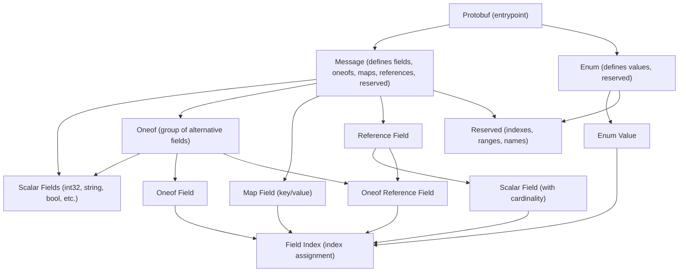

# Microsmith

Microsmith is a Kotlin DSL framework for declaring and composing domain-specific models (schemas, services, etc.).
It produces a lightweight, immutable model from DSL blocks, and provides extension points for plugin authors to add
their own dialects (e.g. Protobuf, JSON for schemas).

This repository is a multi-module Gradle project containing:

- `dsl` – Core DSL primitives and helpers (the entrypoint `microsmith { ... }`, model, builder, and extension APIs).
- `dsl-schemas` – A schema DSL extension which provides `schemas { ... }` block and core schema types.
- `dsl-schemas-protobuf` – A Protobuf schema dialect built on top of `dsl-schemas`, offering a type-safe Kotlin DSL for defining `.proto`-like models.
- `runtime-scripting` – Kotlin scripting host/runtime for `.microsmith.kts` execution.
- `cli` – command-line entrypoint and argument handling for script-driven generation workflows.
- `kotest` – Project-wide Kotest configuration used by the test suites.

## Key features

- The `microsmith {}` entrypoint produces a minimal, immutable `MicrosmithModel`.
- Extensions can attach `MicrosmithExtension` implementations, discoverable from the model
- Schema dialects:
  - `dsl-schemas` provides a generic schema registry
  - `dsl-schemas-protobuf` adds a Protobuf-flavoured DSL with messages, enums, fields, oneofs, maps, and reserved ranges.
    - Kotlin DSL scopes enforce correct usage (e.g. cardinality, reserved ranges, map key/value types)
    - Cross-message references are validated and resolved after model construction
- Kotest property-based and DSL-driven specs ensure correctness.

## Quickstart — build & test

This project uses the Gradle wrapper. From the repository root run:

```bash
./gradlew clean build
```

To run tests only:

```bash
./gradlew kotest
```

To run static analysis:

```bash
./gradlew detekt ktlintCheck
```

To auto-format Kotlin sources:

```bash
./gradlew ktlintFormat
```

Common fixes:
- If `ktlintCheck` fails, run `./gradlew ktlintFormat` and re-run checks.
- If `detekt` fails, inspect module reports under `build/reports/detekt/detekt.html` and address the flagged rules.

Notes:
- Kotlin JVM toolchain is configured to use Java 24 in the root Gradle configuration.
- Tests use Kotest (v6) and the project defines a `KotestConfig` to emit JUnit XML results into the Gradle build directory.

## Publishing
Artifacts are published to GitHub Packages at:
```
https://maven.pkg.github.com/lmliam/microsmith
```

## Usage example

### Core DSL

```kotlin
val model = microsmith {
    // DSL blocks go here, e.g.:
    // schemas { ... } 
}

// Read an extension:
val ext = model.get<YourExtensionType>()
// Read all:
val extensions = model.extensions()
// Read all of type:
val exts = model.extensions().filterIsInstance<YourExtension>()
```

### Protobuf DSL (`dsl-schemas-protobuf`)
The Protobuf extension adds a `protobuf {}` block inside `schemas {}`:
```kotlin
microsmith {
    schemas {
        protobuf {
            message("User") {
                reserved(8..15)
                int32("id") { index(1) }
                string("name") { index(2); optional() }
                repeated { string("tags") }
                oneof("contact") {
                    string("phone")
                    string("slack")
                }
                sfixed64("created_at") { optional() }
                ref("status", "package.Status")
            }
            
            "package" {
                enum("Status") {
                    +"ACTIVE"
                    value("INACTIVE") { index(5) }
                    reserved(3)
                }
            }
        }
    }
}
```

```mermaid
flowchart TD

    Protobuf["Protobuf (entrypoint)"]
    Message["Message (defines fields, oneofs, maps, references, reserved)"]
    Enum["Enum (defines values, reserved)"]
    Reserved["Reserved (indexes, ranges, names)"]
    ScalarFields["Scalar Fields (int32, string, bool, etc.)"]
    ScalarField["Scalar Field (with cardinality)"]
    ReferenceField["Reference Field"]
    Oneof["Oneof (group of alternative fields)"]
    OneofField["Oneof Field"]
    OneofReferenceField["Oneof Reference Field"]
    MapField["Map Field (key/value)"]
    EnumValue["Enum Value"]
    FieldIndex["Field Index (index assignment)"]

    Protobuf --> Message
    Protobuf --> Enum

    Message --> ScalarFields
    Message --> Oneof
    Message --> MapField
    Message --> ReferenceField
    Message --> Reserved

    Enum --> EnumValue
    Enum --> Reserved

    Oneof --> ScalarFields
    Oneof --> OneofField
    Oneof --> OneofReferenceField

    ScalarField --> FieldIndex
    ReferenceField --> ScalarField
    ReferenceField --> OneofReferenceField
    OneofField --> FieldIndex
    OneofReferenceField --> FieldIndex
    MapField --> FieldIndex
    EnumValue --> FieldIndex
```

## CLI Scripting Runtime
Run generation from a script file without embedding Gradle in the consumer project:

```bash
microsmith run schema.microsmith.kts --out ./generated
```

Optional script context values:

```bash
microsmith run schema.microsmith.kts --out ./generated --var env=prod --flag emit
```

Isolation mode:

```bash
microsmith run schema.microsmith.kts --out ./generated --isolation process
```

### Security boundaries and defaults
- Script-time dependency directives (for example `@file:DependsOn` and `@file:Repository`) are denied by default.
- Plugin resolution is endpoint-restricted by a repository allowlist:
  - Built-in allowlist: `https://repo1.maven.org/maven2`
  - Additional allowed endpoints via `MICROSMITH_REPOSITORY_ALLOWLIST` (comma-separated base URIs)
  - `file://` repositories are denied by default and can be explicitly enabled with `MICROSMITH_ALLOW_FILE_REPOSITORIES=true`.
- Plugin artifacts are SHA-256 checked against the script lockfile when present.
- Optional plugin checksum allowlist can be enforced with `MICROSMITH_PLUGIN_ALLOWLIST_FILE`:
  - Entry format: `<kind>|<key>|<sha256>` where `kind` is `remote` or `local`.
- Generated output writes are constrained to the configured output root and reject traversal/symlink escapes.
- Default isolation executes each run in an isolated per-run classloader; `--isolation process` executes in a separate JVM.

Inside .microsmith.kts scripts:
- Default imports include microsmith {}, schemas {}, and protobuf {}.
- Scripts can either return a MicrosmithModel or call emit(model) / generate(model).
- `runtime-scripting` – Kotlin scripting host/runtime for `.microsmith.kts` execution.
- `cli` – command-line entrypoint and argument handling for script-driven generation workflows.

### Distribution artifacts
- Executable fat jar: `cli/build/libs/microsmith-cli-<version>-all.jar`
- Cross-platform distribution archives:
  - `cli/build/distributions/microsmith-cli-<version>-dist.zip`
  - `cli/build/distributions/microsmith-cli-<version>-dist.tar.gz`
- Build them with `./gradlew :cli:distArtifacts`

### Adoption docs
- `docs/cli/README.md`
- `docs/cli/quickstart-non-gradle.md`
- `docs/cli/migration-from-gradle.md`
- `docs/cli/troubleshooting.md`
- `docs/cli/runtime-bundling-evaluation.md`
