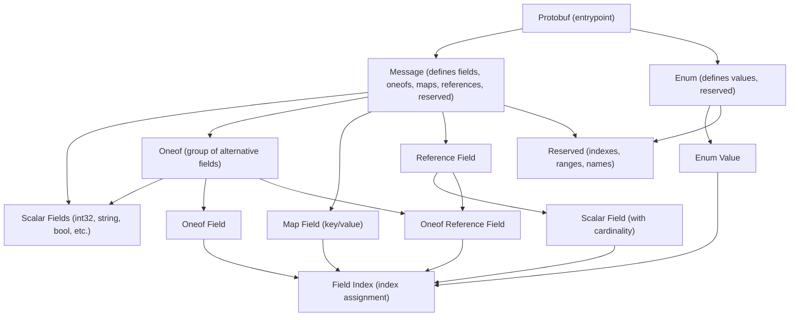

# Microsmith

Microsmith is a Kotlin DSL framework for declaring and composing domain-specific models (schemas, services, etc.).
It produces a lightweight, immutable model from DSL blocks, and provides extension points for plugin authors to add
their own dialects (e.g. Protobuf, JSON for schemas).

This repository is a multi-module Gradle project containing:

- `dsl` - Core DSL primitives and helpers (the entrypoint `microsmith { ... }`, model, builder, and extension APIs).
- `dsl-schemas` - A schema DSL extension which provides `schemas { ... }` block and core schema types.
- `dsl-schemas-protobuf` - A Protobuf schema dialect built on top of `dsl-schemas`, offering a type-safe Kotlin DSL for defining `.proto`-like models.
- `scripting` - Kotlin scripting host that evaluates `.microsmith.kts` files into `MicrosmithModel` instances.
- `cli` - A runnable command-line interface for executing Microsmith scripts and invoking generators.
- `kotest` - Project-wide Kotest configuration used by the test suites.

## Key features

- The `microsmith {}` entrypoint produces a minimal, immutable `MicrosmithModel`.
- Extensions can attach `MicrosmithExtension` implementations, discoverable from the model
- Schema dialects:
- `dsl-schemas` - A schema DSL extension which provides `schemas { ... }` block and core schema types.
- `dsl-schemas-protobuf` - A Protobuf schema dialect built on top of `dsl-schemas`, offering a type-safe Kotlin DSL for defining `.proto`-like models.
    - Kotlin DSL scopes enforce correct usage (e.g. cardinality, reserved ranges, map key/value types)
    - Cross-message references are validated and resolved after model construction
- Kotest property-based and DSL-driven specs ensure correctness.

## Quickstart — build & test

This project uses the Gradle wrapper. From the repository root run:

```bash
./gradlew clean build
```

To run tests only:

```bash
./gradlew kotest
```

Notes:
- Kotlin JVM toolchain is configured to use Java 24 in the root Gradle configuration.
- Tests use Kotest (v6) and the project defines a `KotestConfig` to emit JUnit XML results into the Gradle build directory.

## Publishing
Artifacts are published to GitHub Packages at:
```
https://maven.pkg.github.com/lmliam/microsmith
```

## Usage example

### Core DSL

```kotlin
val model = microsmith {
    // DSL blocks go here, e.g.:
    // schemas { ... } 
}

// Read an extension:
val ext = model.get<YourExtensionType>()
// Read all:
val extensions = model.extensions()
// Read all of type:
val exts = model.extensions().filterIsInstance<YourExtension>()
```

### Protobuf DSL (`dsl-schemas-protobuf`)
The Protobuf extension adds a `protobuf {}` block inside `schemas {}`:
```kotlin
microsmith {
    schemas {
        protobuf {
            message("User") {
                reserved(8..15)
                int32("id") { index(1) }
                string("name") { index(2); optional() }
                repeated { string("tags") }
                oneof("contact") {
                    string("phone")
                    string("slack")
                }
                sfixed64("created_at") { optional() }
                ref("status", "package.Status")
            }
            
            "package" {
                enum("Status") {
                    +"ACTIVE"
                    value("INACTIVE") { index(5) }
                    reserved(3)
                }
            }
        }
    }
}
```

```mermaid
flowchart TD

    Protobuf["Protobuf (entrypoint)"]
    Message["Message (defines fields, oneofs, maps, references, reserved)"]
    Enum["Enum (defines values, reserved)"]
    Reserved["Reserved (indexes, ranges, names)"]
    ScalarFields["Scalar Fields (int32, string, bool, etc.)"]
    ScalarField["Scalar Field (with cardinality)"]
    ReferenceField["Reference Field"]
    Oneof["Oneof (group of alternative fields)"]
    OneofField["Oneof Field"]
    OneofReferenceField["Oneof Reference Field"]
    MapField["Map Field (key/value)"]
    EnumValue["Enum Value"]
    FieldIndex["Field Index (index assignment)"]

    Protobuf --> Message
    Protobuf --> Enum

    Message --> ScalarFields
    Message --> Oneof
    Message --> MapField
    Message --> ReferenceField
    Message --> Reserved

    Enum --> EnumValue
    Enum --> Reserved

    Oneof --> ScalarFields
    Oneof --> OneofField
    Oneof --> OneofReferenceField

    ScalarField --> FieldIndex
    ReferenceField --> ScalarField
    ReferenceField --> OneofReferenceField
    OneofField --> FieldIndex
    OneofReferenceField --> FieldIndex
    MapField --> FieldIndex
    EnumValue --> FieldIndex
```

## Scripting + CLI

Microsmith scripts are just Kotlin `main.kts` scripts. Use `.microsmith.kts`, `.main.kts`, or a plain `.kts` that contains `// microsmith` as a marker:
```kotlin
// microsmith
// @file:DependsOn("com.yourco:custom-microsmith-plugin:1.0.0") // optional plugin jars

microsmith {
    schemas {
        protobuf {
            message("User") { int32("id") { index(1) } }
        }
    }
}
```
- Build the runnable CLI: `./gradlew :cli:shadowJar`
- Run a script: `java -jar cli/build/libs/microsmith-cli.jar run path/to/microsmith.kts --out build/microsmith-out`
- Add plugins/generators: pass `--plugin group:artifact:version` (resolved via Maven) or declare `@file:DependsOn` in the script. Implement `MicrosmithGenerator` (or `ModelGenerator`) with a `META-INF/services` entry so `ServiceLoader` can discover it.
- Filter generators with `--generator <id>` and emit a machine-readable log with `--json-summary`.
- Compiled scripts are cached under `~/.cache/microsmith` by default (override via `ScriptOptions.cacheDir`).
- Scripts execute arbitrary Kotlin code; only run trusted scripts.
